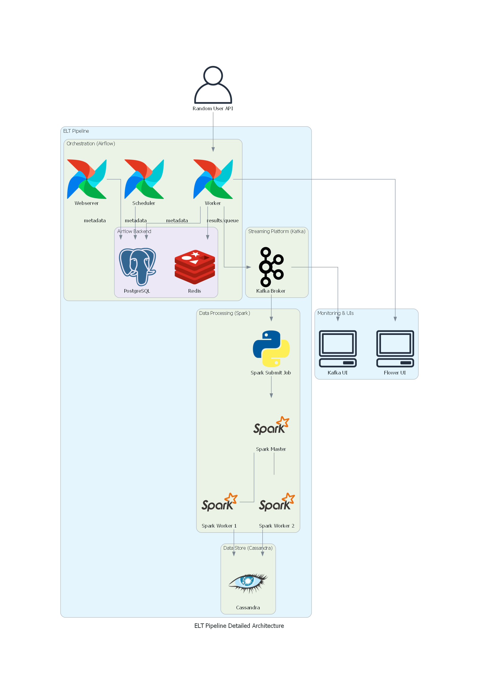

# ETL Data Pipeline

## Overview
This project implements a robust ELT (Extract, Load, Transform) data pipeline using Apache Airflow, Apache Kafka, Apache Cassandra, and Apache Spark. The architecture is designed for scalable, real-time data ingestion, processing, and storage.

## Architecture



## Components

- **Airflow**: Orchestrates the data pipeline using DAGs (Directed Acyclic Graphs).
- **Kafka**: Handles real-time data streaming and ingestion.
- **Cassandra**: Serves as the distributed NoSQL database for storing processed data.
- **Spark**: Performs data transformation and analytics on ingested data.

## Directory Structure

```
├── diagram.py
├── docker-compose.yaml
├── elt_pipeline_detailed_architecture.png
├── airflow/
│   ├── dags/
│   │   └── kafka_dag.py
│   └── logs/
├── cassandra/
│   └── init.cql
├── spark/
│   └── stream_job.py
```

## Getting Started

### Prerequisites
- Docker & Docker Compose
- Python 3.6+

### Setup
1. **Clone the repository:**
   ```sh
git clone https://github.com/ayoubnajjout/ETL-data-pipeline.git
cd ETL-data-pipeline
      ```
2. **Start the services:**
   ```sh
docker-compose up --build
   ```
3. **Access Airflow UI:**
   - Navigate to `http://localhost:8080` in your browser.

## Usage
- Place your Airflow DAGs in `airflow/dags/`.
- Modify `cassandra/init.cql` for your schema.
- Update or add Spark jobs in `spark/stream_job.py`.

## Example DAG
See `airflow/dags/kafka_dag.py` for a sample DAG integrating Kafka, Spark, and Cassandra.

## Logs
- Airflow logs: `airflow/logs/`
- Spark logs: Check container logs or configure log output.
- Cassandra logs: Check container logs.

## Contributing
Pull requests are welcome. For major changes, please open an issue first to discuss what you would like to change.

## License
[MIT](LICENSE)
